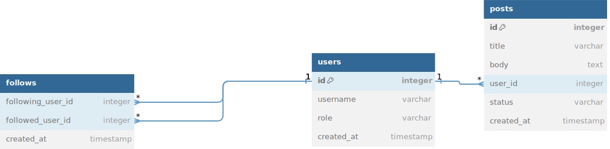

# MVP "Проектирование мессенджера"
___
## 1. Требования
Необходимо спроектировать мессенджер, аналогично WhatsApp.

Проектируем только логику работы бекенда без учета авторизации.

Приложение проектируется со следующими бизнес ограничениями:
* Расчет на 1 год без учета потенциального роста системы и активностей клиента
* Без учета настроек пользовательского приложения
* Без учета возможности к одному устройству привязывать несколько учетных записей
* Без проектирования логики работы сервиса по отправке push-уведомлений
* Не учитывается возможности для поддержки и обслуживания системы и пользователей (админка)

| **Тип требований** | **Атрибут (для НФТ)**       | **Описание**                                                                                                                                                                                                                             |
|----|-------------------------|--------------------------------------------------------------------------------------------------------------------------------------------------------------------------------------------------------------------------------------|
|БТ  | -                       | Сезонности у системы нет                                                                                                                                                                                                             |
|НФТ | Удобство использования  | Системой будут пользоваться по всему миру                                                                                                                                                                                            |
|ФТ  | -                       | Приложение будет показывать непрочитанные сообщения                                                                                                                                                                                  |
|ФТ  | -                       | Приложение будет поддерживать чаты и личные сообщения                                                                                                                                                                                |
|НФТ | Производительность      | Отправлять можно только текст и картинки в сообщениях                                                                                                                                                                                |
|НФТ | Производительность      | Максимальный размер изображения в сообщении = 500 КБ                                                                                                                                                                                 |
|НФТ | Производительность      | Максимальное кол-во изображений в сообщении = 3                                                                                                                                                                                      |
|НФТ | Производительность      | Максимальный размер текста в сообщении = 2000 символов                                                                                                                                                                               |
|НФТ | Производительность      | 200 000 000 уникальных пользователей будут заходить в приложение каждый день                                                                                                                                                         |
|НФТ | Производительность      | Каждый пользователь в среднем будет отправлять 10 сообщений в день                                                                                                                                                                   |
|НФТ | Производительность      | Каждый пользователь в среднем будет просматривать сообщения 20 раз в день                                                                                                                                                            |
|НФТ | Доступность             | Система должна работать 24 на 7 (*допустимо несколько часов простоя в год*)                                                                                                                                                          |
|ФТ  | -                       | Приложение должно будет показывать статусы онлайн/оффлайн пользователей, а также когда пользователь был последний раз в сети                                                                                                         |
|НФТ | Производительность      | Сообщение до получателя должно успевать доходить за 3 секунды (*если пользователя нет в сети - ему должно прийти Push уведомление на мобильный телефон*);                                                                            |
|НФТ | Удобство использования  | Приложение должно поддерживать кросс-девайсную синхронизацию (*если у вас это приложение открыто на телефоне и ноутбуке, и например вы прочитали сообщение на телефоне, то сообщение должно отобразиться прочитанным и на ноутбуке*) |

## 4. Сценарии использования
1. Войти в приложение через различные точки входа (мобильное приложение, веб).
2. Создать новый чат (групповой или личный)
3. Отправить сообщение 
4. Получить сообщение 

## 5. Архитектура

## 6. Модель данных
